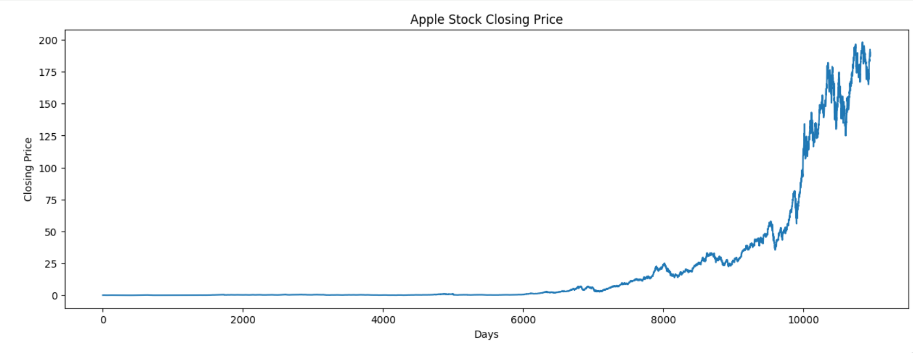
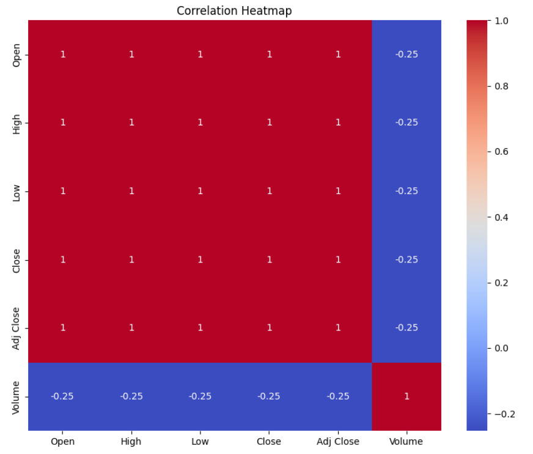
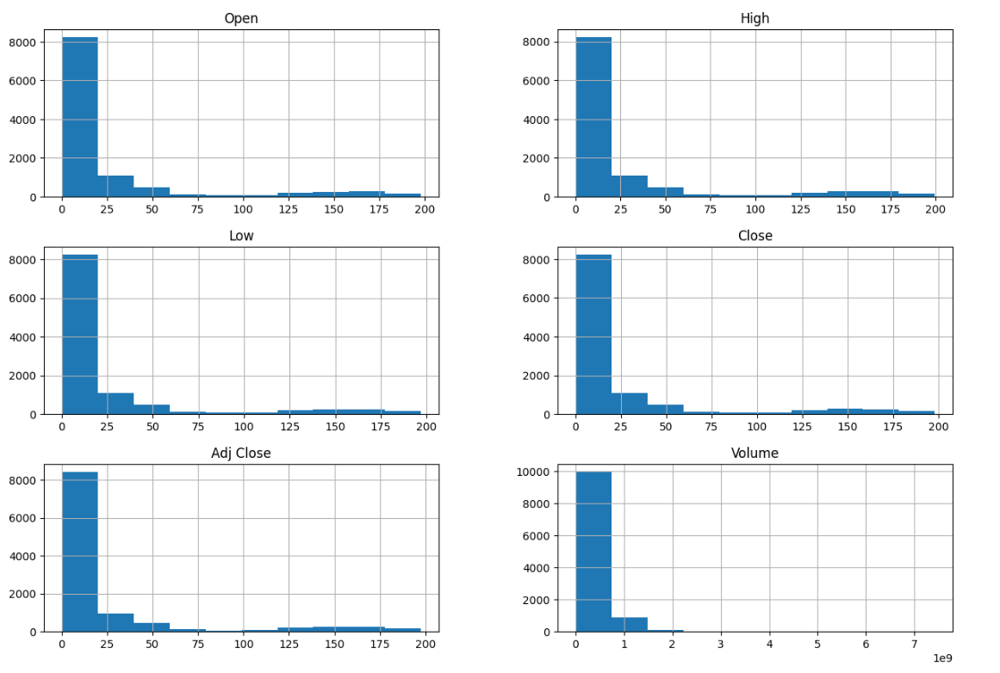

# 📈 Stock Price Prediction using Machine Learning

## 📖 Project Overview

This project predicts stock closing prices using the Linear Regression Machine Learning algorithm. Historical stock market data was collected from Kaggle and analyzed using Python. The project includes data preprocessing, visualization, model training, prediction, and evaluation.

---

## 🎯 Objectives

- Analyze historical stock market data
- Clean and preprocess the dataset
- Visualize stock price trends
- Train a Linear Regression model
- Predict stock closing prices
- Evaluate the model using standard metrics

---

## 🛠️ Technologies Used

- Python
- Google Colab
- Pandas
- NumPy
- Matplotlib
- Seaborn
- Scikit-learn

---

## 📂 Dataset

Source: Kaggle

Features used:

- Date
- Open
- High
- Low
- Close
- Volume

---

## 🤖 Machine Learning Model

- Linear Regression

---

## 📋 Project Workflow

1. Import Libraries
2. Load Dataset
3. Data Cleaning
4. Exploratory Data Analysis (EDA)
5. Data Visualization
6. Feature Selection
7. Train-Test Split
8. Model Training
9. Stock Price Prediction
10. Model Evaluation

---

## 📊 Evaluation Metrics

- Mean Absolute Error (MAE)
- Mean Squared Error (MSE)
- Root Mean Squared Error (RMSE)
- R² Score

---

## 📸 Project Screenshots

### Closing Price Trend

### Correlation Heatmap

### Histogram

---

## 🚀 Future Improvements

- Random Forest Regressor
- XGBoost
- LSTM Deep Learning Model
- Real-Time Stock Price Prediction
- Streamlit Web Application

---

## 👨‍💻 Author

**VENKATA SHARATH KUMAR JAKKI**

Machine Learning Enthusiast | Python Developer
